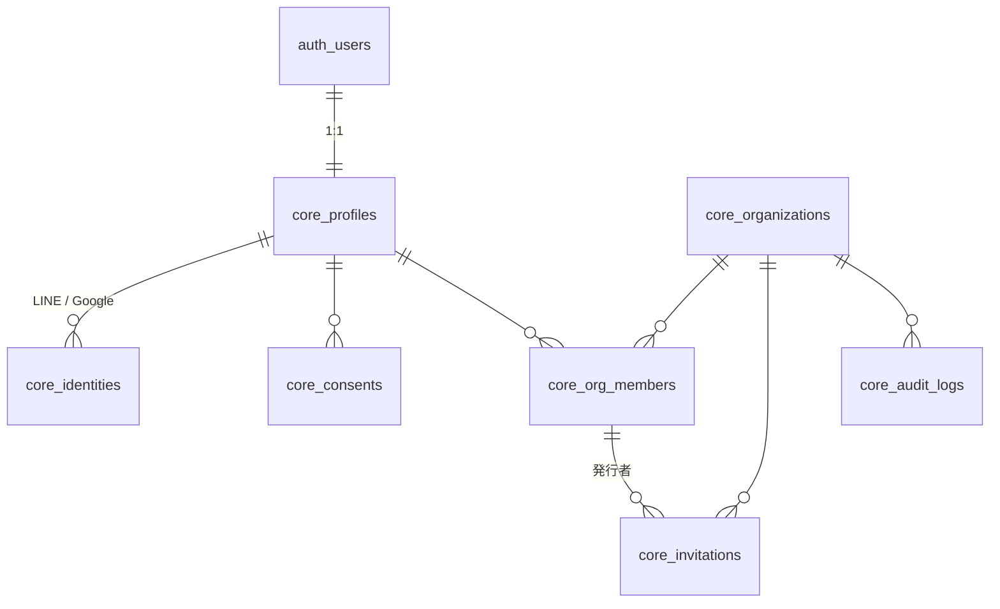

# 🪪 共通アカウント基盤（仮称: PUZZLIAR ID）設計案 v0.1

> 稽古・シフト管理（無料・アカウント獲得のフック）、チケット販売管理（`docs/requirements.md`）、事前物販・当日物販の各サービスを **1 つのアカウントと 1 つの組織台帳** で使えるようにするための共通基盤の設計案。稽古管理 v0.2（`docs/rehearsal-requirements.md`）のフェーズ A で最初に実装する。
>
> 作成日: 2026-09-13 ／ ステータス: **v0.1 実装済み**（マイグレーション `core_platform_rehearsal_v2`。稽古管理が利用中。チケット `tk_` の載せ替えは未着手＝Q27 の決定どおり）

# 1. 設計原則

1. **基盤は小さく保つ**。持つのは「人」「組織」「所属」「招待」「外部 ID」「同意」だけ。各サービスの業務データは各サービスのプレフィックス（`rh_` / `tk_` / 物販）に置く
2. **人と組織は多対多**。キャストは複数劇団に所属し、主催者は他劇団のキャストでもある。ロールは所属（組織メンバーシップ）に付く
3. **個人データは人に、業務データは組織に属する**。空き時間・通知設定・外部連携は人に属し、組織をまたいで 1 セット。組織を離れても消えない
4. **認証は Supabase Auth を共通利用**（既存方針）。`auth.users` を直接参照せず、基盤の `core_profiles` を経由する
5. **権限は DB 層（RLS）で強制**。判定関数を基盤が提供し、各サービスの RLS はそれを呼ぶだけにする
6. **ID は基盤が発番**。組織・人の UUID を各サービスが外部キーとして参照する（チケット要件書で「事前物販OS発番」としていた組織・キャストの ID は、本基盤の発番に改める → 3.4）

# 2. ER 概要



# 3. テーブル定義（ドラフト）

```sql
-- 人(アカウント)。auth.users と 1:1
create table core_profiles (
  id uuid primary key,                                   -- = auth.users.id
  display_name text not null,                            -- 芸名可
  email text,                                            -- auth.users.email のコピー(検索・通知用)
  default_part text check (default_part in ('cast','staff','director','organizer')),
  locale text not null default 'ja',
  timezone text not null default 'Asia/Tokyo',
  notify_email boolean not null default true,
  notify_line boolean not null default true,
  notify_webpush boolean not null default false,
  deleted_at timestamptz,                                -- 退会(匿名化済み)
  created_at timestamptz not null default now(),
  updated_at timestamptz not null default now()
);

-- 外部 ID(ログインプロバイダ・通知先)。LINE Login の userId は Messaging API の userId と同一チャネルプロバイダなら一致する
create table core_identities (
  profile_id uuid not null references core_profiles(id) on delete cascade,
  provider text not null check (provider in ('line','google')),
  provider_uid text not null,
  email text,
  secret_enc text,                                       -- Google refresh token 等(AES-256-GCM)
  scopes text[] not null default '{}',
  connected_at timestamptz not null default now(),
  primary key (profile_id, provider),
  unique (provider, provider_uid)
);

-- 規約・マーケティング同意(バージョン管理)
create table core_consents (
  id bigserial primary key,
  profile_id uuid not null references core_profiles(id) on delete cascade,
  kind text not null check (kind in ('terms','privacy','marketing','availability_sharing')),
  version text not null,
  granted boolean not null,
  recorded_at timestamptz not null default now()
);

-- 組織(劇団・主催者)
create table core_organizations (
  id uuid primary key default gen_random_uuid(),
  slug text not null unique,                             -- URL 用
  name text not null,
  kind text not null default 'troupe' check (kind in ('troupe','producer','individual','other')),
  region text,
  status text not null default 'active' check (status in ('active','archived','suspended')),
  created_by uuid references core_profiles(id),
  created_at timestamptz not null default now(),
  updated_at timestamptz not null default now()
);

-- 所属(組織メンバーシップ)。ロールは組織ごと
create table core_org_members (
  org_id uuid not null references core_organizations(id) on delete cascade,
  profile_id uuid not null references core_profiles(id) on delete cascade,
  role text not null default 'member' check (role in ('owner','admin','member')),
  part text not null default 'cast' check (part in ('cast','staff','director','organizer')),
  status text not null default 'active' check (status in ('active','left','removed')),
  joined_at timestamptz not null default now(),
  primary key (org_id, profile_id)
);

-- 招待リンク
create table core_invitations (
  id uuid primary key default gen_random_uuid(),
  org_id uuid not null references core_organizations(id) on delete cascade,
  token text not null unique default encode(gen_random_bytes(16),'hex'),
  role text not null default 'member' check (role in ('admin','member')),
  part text,                                             -- 参加時の既定区分(本人が変更可)
  max_uses int,                                          -- null = 無制限
  used_count int not null default 0,
  expires_at timestamptz not null,
  created_by uuid references core_profiles(id),
  revoked_at timestamptz,
  created_at timestamptz not null default now()
);

-- 監査ログ(組織横断)
create table core_audit_logs (
  id bigserial primary key,
  org_id uuid,
  actor_profile_id uuid,
  action text not null,                                  -- 'org.create','member.remove','invitation.revoke',...
  target text,
  detail jsonb,
  created_at timestamptz not null default now()
);
```

# 4. RLS ヘルパー（各サービス共通）

```sql
-- ログイン中の profile id
create function core_my_profile_id() returns uuid
language sql stable as $$ select auth.uid() $$;

-- 指定組織のメンバーか(active のみ)
create function core_is_member(p_org uuid) returns boolean
language sql stable security definer set search_path = public as $$
  select exists (select 1 from core_org_members
                 where org_id = p_org and profile_id = auth.uid() and status = 'active')
$$;

-- 指定組織で admin 以上か
create function core_is_admin(p_org uuid) returns boolean
language sql stable security definer set search_path = public as $$
  select exists (select 1 from core_org_members
                 where org_id = p_org and profile_id = auth.uid() and status = 'active'
                   and role in ('owner','admin'))
$$;

-- 自分が所属する組織 id の集合(個人ビューの横断取得用)
create function core_my_org_ids() returns setof uuid
language sql stable security definer set search_path = public as $$
  select org_id from core_org_members where profile_id = auth.uid() and status = 'active'
$$;
```

各サービスの RLS はこれらを使う。例（稽古管理）:

```sql
create policy rh_productions_member_read on rh_productions
  for select using (core_is_member(org_id));
create policy rh_productions_admin_write on rh_productions
  for all using (core_is_admin(org_id)) with check (core_is_admin(org_id));
```

`security definer` 関数は `anon` からの `execute` を取り消し、`authenticated` のみに許可する（Supabase のセキュリティ診断で警告になるため）。

# 5. 認証・ログイン

| 手段 | 用途 | 備考 |
|---|---|---|
| メール＋パスワード | 全ユーザー | メール確認必須。Supabase Auth 標準 |
| Google ログイン | 主催者・キャスト | Supabase Auth の Google プロバイダ。カレンダー連携の OAuth とは**別**（連携は追加スコープの同意が必要なため `core_identities` で別管理） |
| LINE ログイン | キャストの第一導線 | Supabase Auth に LINE プロバイダはないため、**LINE Login v2.1（OIDC）を自前実装**し、`signInWithIdToken` は使えないので「LINE で本人確認 → Supabase のカスタムトークン（Edge Function で発行）」または「LINE の email をキーにマジックリンク」の 2 案。前者を推奨（→ 8. 論点） |

新規登録時に `core_profiles` を作成するトリガー（`auth.users` の insert 後）を置く。ソーシャルログインで得た表示名を初期値にする。

# 6. 各サービスからの利用

## 6.1 稽古管理（`rh_`）

- `rh_members` を廃止し、`core_profiles`（個人）と `rh_participants`（組織内の参加者。仮メンバーは `profile_id null`）に分割
- 可用性・Google 同期・通知ログは `profile_id` 参照
- 組織コンテキストは URL の `orgSlug` から解決し、`core_is_member / core_is_admin` で RLS

## 6.2 チケット販売管理（`tk_`）

- `tk_organizations` → `core_organizations` を参照（既存行は基盤へ移行し、同じ UUID を維持）
- `tk_app_users`（user_id, org_id, role: admin/staff/cast）→ `core_org_members` に統合。チケット固有の `staff`（受付）ロールは、基盤の `member` ＋ `part = 'staff'` に対応させる。既存の `tk_app_role()` は `core_org_members` を参照するビュー／関数に置き換え、RLS ポリシー本文は当面変更しない
- `tk_casts.user_id` → `profile_id`。稽古管理の参加者台帳からキャストを一括で公演に登録できる（フェーズ F）
- 購入者はアカウントレスのまま（要件書 3 章）

## 6.3 物販システム

- 同様に `core_organizations` / `core_org_members` を参照。キャスト別集計の「キャスト」は `core_profiles` に対応

## 6.4 サービス間で共有しないもの

- 各サービスの業務データ（稽古枠、注文、商品）は共有しない。相互参照が必要な場合は**契約ビュー**（`tk_ticket_sales_by_cast_v1` のような読み取り専用ビュー）で提供する既存方針を維持

# 7. 移行計画（フェーズ A）

1. `core_` テーブルと関数を作成
2. 既存 `auth.users` から `core_profiles` を生成（`tk_app_users.display_name` を初期値）
3. `tk_organizations` の行を `core_organizations` へ複製（同 UUID、slug を採番）
4. `tk_app_users` → `core_org_members`（admin → admin、staff → member/staff、cast → member/cast）。`tk_organizations` の作成者を owner に
5. `rh_members` → `core_profiles`（user_id あり）／`rh_participants`。LINE・Google 連携を `core_identities` へ
6. `tk_app_role()` / `rh_my_member_id()` を基盤参照に差し替え（既存 RLS は互換維持）
7. アプリ側: `getAppUser()` → `getSessionUser()`（profile）＋ `getOrgMembership(orgId)`。`ORG_ID` 定数を撤去

移行はダウンタイムなしで行える（新テーブル追加 → データ複製 → 関数差し替え → アプリ切替 → 旧テーブル削除）。**本番に主催者・キャストのデータが増える前**に実施する。

# 8. 論点（要決定）

| # | 論点 | 提案 |
|---|---|---|
| A1 | LINE ログインの実装方式（Supabase Auth 非対応） | **実装済み**: LINE Login v2.1 で code → id_token を取得し LINE の verify エンドポイントで検証。`core_identities(line)` からユーザーを特定（無ければ作成）し、`auth.admin.generateLink(magiclink)` の `hashed_token` を SSR クライアントの `verifyOtp` に渡してセッション発行（`/auth/line/callback`） |
| A2 | LINE Login の userId と Messaging API の userId を一致させるため、**同一プロバイダー配下**に両チャネルを置く | LINE Developers で 1 プロバイダーに「ログインチャネル」「Messaging API チャネル」を作る |
| A3 | 組織 slug の扱い（URL に劇団名を出すか、UUID か） | slug（変更可・履歴保持） |
| A4 | 1 アカウントの組織作成上限・招待の既定期限 | 10 組織、14 日 |
| A5 | `part` の語彙（cast/staff/director/organizer）を全サービス共通にするか、サービスごとに拡張するか | 基盤は 4 値固定。サービス固有の細分（受付・物販担当など）は各サービス側で持つ |
| A8 | 招待制の実装 | `core_organizer_codes`（運営発行のコード）。`ORG_CREATION_OPEN=true` で解除 |
| A9 | 運営権限 | `core_profiles.is_platform_admin`。初期値は harbingerstar@gmail.com のみ |
| A6 | 退会時の匿名化の実装（`core_profiles.display_name` を「退会済みユーザー」に置換、`email` と `core_identities` を削除） | 提案どおり。30 日の猶予後に実行 |
| A7 | Supabase Auth の Google プロバイダと、カレンダー連携の Google OAuth を統合するか | 分離（ログインは最小スコープ、カレンダーは追加同意）。将来の incremental auth で統合検討 |
