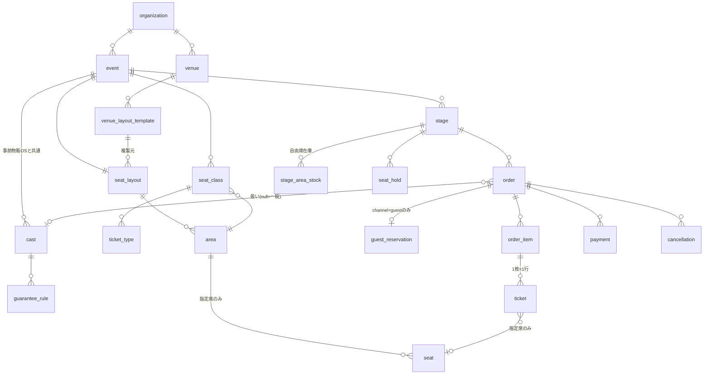

# 🗄️ チケット販売管理システム ドメインモデル・DB設計（v0.1 ドラフト）

> 要件定義書 v1.1（`docs/requirements.md`）を「正」として、ドメインモデル・DBスキーマ・RLS方針・整合性ルールを設計するドキュメント。要件定義書 7章のドラフトで「domain設計フェーズで確定する」とした論点をここで決定する。
>
> 作成日: 2026-07-26 ／ ステータス: 設計ドラフト（要レビュー）

# 1. 設計原則

1. **物販システム群との整合**: 同一 Supabase プロジェクト共有・共通 Auth・org_id マルチテナント・ID体系統一（公演・キャスト・組織は事前物販OSの発番を使う）
2. **権限はDB層で強制**: RLS を全テーブルに適用。フロント・APIのフィルタに依存しない
3. **計算の再現性**: ギャランティ計算は販売時点のルールをスナップショット保存。金額は集計時に純額（販売−取消−返金）へ再計算
4. **在庫の整合はDBの制約で守る**: アプリロジックではなく、一意制約・チェック制約・アトミック更新で二重販売を構造的に防ぐ
5. **外部への公開面は契約化**: 事前物販OSへのデータ提供は versioned な読み取り専用ビューのみ

# 2. ER 概要



# 3. テーブル定義（ドラフト）

型・制約は Supabase (PostgreSQL) 前提。全テーブルに `org_id uuid not null` と `created_at / updated_at` を持つ（以下では省略）。公演・キャスト・組織の ID は事前物販OS発番の UUID をそのまま外部キーとして参照する。

## 3.1 会場・レイアウト

```sql
create table venue (
  id uuid primary key default gen_random_uuid(),
  org_id uuid not null references organization(id),
  name text not null
);

-- 会場テンプレート（会場ごとの基本の組み方）
create table venue_layout_template (
  id uuid primary key default gen_random_uuid(),
  org_id uuid not null,
  venue_id uuid not null references venue(id),
  name text not null,          -- 例: 「標準120席」「桟敷あり100席」
  layout_json jsonb not null   -- 座席の座標・列・番号のドラフト（テンプレは正規化しない）
);

-- 公演別レイアウト（テンプレから複製して確定。ここからは正規化して保持）
create table seat_layout (
  id uuid primary key default gen_random_uuid(),
  org_id uuid not null,
  event_id uuid not null,                 -- 事前物販OS発番の公演ID
  source_template_id uuid references venue_layout_template(id),
  name text not null,
  locked_at timestamptz                   -- 販売開始後は座席削除を禁止（増席は可）
);

create table area (
  id uuid primary key default gen_random_uuid(),
  org_id uuid not null,
  seat_layout_id uuid not null references seat_layout(id),
  name text not null,                     -- 例: 「前方指定席ブロック」「自由席」
  kind text not null check (kind in ('reserved','free')),
  free_capacity int check (kind != 'free' or free_capacity is not null)
);

create table seat (
  id uuid primary key default gen_random_uuid(),
  org_id uuid not null,
  area_id uuid not null references area(id),
  row_label text not null,                -- 「A」「B」…（桟敷等は任意文字列）
  seat_number int not null,
  pos_x numeric not null,                 -- 自由配置座標（グリッドに縛られない）
  pos_y numeric not null,
  block_group int not null default 0,     -- 同一行内の「連続ブロック」ID（通路で区切る）
  is_active boolean not null default true,-- 増席/見切れ席の無効化はフラグで（削除しない）
  unique (area_id, row_label, seat_number)
);
```

**決定: 連番席の判定は `(row_label, block_group)` が同一かつ `seat_number` が連続、と定義する。** 通路・段差による分断は座席登録時に `block_group` を分けることで表現する（アルゴリズム側で座標から推測しない。レイアウト編集UIで通路位置を指定させる）。

## 3.2 席種・券種

```sql
create table seat_class (
  id uuid primary key default gen_random_uuid(),
  org_id uuid not null,
  event_id uuid not null,
  area_id uuid not null references area(id),
  name text not null,                     -- 「プレミアム指定席」「一般自由席」
  price int not null                      -- 円（税込）
);

create table ticket_type (
  id uuid primary key default gen_random_uuid(),
  org_id uuid not null,
  seat_class_id uuid not null references seat_class(id),
  name text not null,                     -- 「一般前売」「当日券」「学割」「招待」
  price int not null,
  sales_channel text[] not null default '{online}',  -- online / door / guest
  sales_starts_at timestamptz,
  sales_ends_at timestamptz
);
```

## 3.3 キャスト・扱いルール

```sql
-- cast は事前物販OSの共通マスタを参照（本システムでは作成しない）
-- guarantee_rule は本システム所有（チケット領域のルール）
create table guarantee_rule (
  id uuid primary key default gen_random_uuid(),
  org_id uuid not null,
  event_id uuid not null,
  cast_id uuid not null,                  -- 事前物販OS発番
  rule_type text not null check (rule_type in ('rate','fixed','quota')),
  rate numeric,                           -- rate: 扱い売上の◯%
  fixed_amount int,                       -- fixed: 1枚あたり◯円
  quota_threshold int,                    -- quota: ◯枚までは対象外
  quota_amount int,                       -- quota: 超過分1枚あたり◯円
  effective_from timestamptz not null default now(),
  unique (event_id, cast_id, effective_from)
);
```

## 3.4 注文・チケット

```sql
create table "order" (
  id uuid primary key default gen_random_uuid(),
  org_id uuid not null,
  stage_id uuid not null references stage(id),
  channel text not null check (channel in ('general','guest','door')),
  cast_id uuid,                            -- 扱い。null = 「一般」（主催扱い）
  buyer_name text not null,
  buyer_email text,                        -- door販売・ゲスト予約では省略可
  payment_method text not null check (payment_method in ('online','cash_at_door','cast_paid')),
  settlement_method text check (
    payment_method != 'cast_paid'
    or settlement_method in ('online','cash_at_door','cash_with_organizer')),
  payment_status text not null default 'pending'
    check (payment_status in ('pending','paid','cancelled','refunded','partially_refunded')),
  total int not null,
  status text not null default 'active'
    check (status in ('active','cancelled'))
);

-- ゲスト予約はorderの1:1拡張（決定: channel属性のみでなく別テーブル。5.1参照）
create table guest_reservation (
  order_id uuid primary key references "order"(id),
  org_id uuid not null,
  cast_id uuid not null,                   -- 起票したキャスト（=orderのcast_idと一致させる）
  guest_name text not null,
  seat_assignment text not null default 'auto'
    check (seat_assignment in ('auto','split_confirmed')),  -- 離れ席をキャストが了承した場合 split_confirmed
  payment_due_at timestamptz,              -- オンライン決済リンクの期限
  note text
);

create table order_item (
  id uuid primary key default gen_random_uuid(),
  org_id uuid not null,
  order_id uuid not null references "order"(id),
  ticket_type_id uuid not null references ticket_type(id),
  qty int not null check (qty > 0),
  unit_price int not null,                 -- 販売時点の価格スナップショット
  guarantee_snapshot jsonb                 -- 販売時点の適用ルール {rule_type, rate, fixed_amount, ...}
);

create table ticket (
  id uuid primary key default gen_random_uuid(),
  org_id uuid not null,
  order_item_id uuid not null references order_item(id),
  seat_id uuid references seat(id),        -- 指定席のみ。自由席はnull
  entry_number int,                        -- 自由席のみ。ステージ×エリア単位の購入順連番
  qr_token text not null unique,           -- HMAC署名付きトークン
  holder_name text,                        -- 分配後の保持者（任意）
  transfer_token text unique,              -- 分配リンク用（未分配はnull）
  transferred_at timestamptz,
  checkin_status text not null default 'not_checked_in'
    check (checkin_status in ('not_checked_in','checked_in','void')),
  checked_in_at timestamptz,
  checked_in_by uuid                       -- 受付スタッフのuser_id
);

-- 【二重販売防止の要】有効チケットは同一ステージ×座席で1枚のみ
-- ticketはstage_idを非正規化して持たせる（インデックスのため）
alter table ticket add column stage_id uuid not null;
create unique index uq_ticket_seat_per_stage
  on ticket (stage_id, seat_id)
  where seat_id is not null and checkin_status != 'void';
```

**決定: 指定席の二重販売防止は「部分一意インデックス」で構造的に保証する。** アプリのチェック漏れやレース条件があっても、DBが同一ステージ・同一座席の有効チケット2枚目を拒否する。

## 3.5 自由席在庫・整理番号

```sql
-- 自由席在庫: ステージ×自由席エリアごとの残数カウンタ（決定: 5.2参照）
create table stage_area_stock (
  stage_id uuid not null references stage(id),
  area_id uuid not null references area(id),
  org_id uuid not null,
  capacity int not null,
  remaining int not null check (remaining >= 0),
  next_entry_number int not null default 1,   -- 整理番号の採番カウンタ
  primary key (stage_id, area_id)
);
```

- 購入確定時に 1 トランザクションで `update ... set remaining = remaining - :qty, next_entry_number = next_entry_number + :qty where remaining >= :qty` を実行し、更新行が0なら売り切れとして失敗させる（**アトミック減算 + check制約**）
- 整理番号は同じ UPDATE で採番レンジを確保するため、**決済完了順＝購入順**で欠番なく連番になる
- 夜間バッチで `remaining` と ticket 行数の突合検証を行い、不一致を検知したらアラート（自己修復はしない）

## 3.6 仮押さえ（seat_hold）

```sql
-- 決定: 期限付き行 + 部分一意インデックス方式（DBロック方式は採らない。5.3参照）
create table seat_hold (
  id uuid primary key default gen_random_uuid(),
  org_id uuid not null,
  stage_id uuid not null,
  seat_id uuid,                            -- 指定席のホールド
  area_id uuid,                            -- 自由席のホールド（qty分）
  qty int not null default 1,
  session_key text not null,               -- 購入フローのセッション識別子
  stripe_checkout_session_id text,         -- Checkout開始後に紐付け
  expires_at timestamptz not null,
  check ((seat_id is not null) != (area_id is not null))
);

-- 同一ステージ×座席の有効ホールドは1件のみ
create unique index uq_hold_seat_per_stage
  on seat_hold (stage_id, seat_id)
  where seat_id is not null;
```

- ホールドは**期限（例: 10分）付きの行**として作成。期限切れ行は pg_cron で定期削除し、購入確定時は「自セッションの未失効ホールドが存在すること」を検証してから ticket を発行する
- 自由席のホールドは `stage_area_stock.remaining` を仮減算せず、確定時のアトミック減算に一本化する（ホールドは座席図の表示制御と指定席の排他のみに使う）。自由席は在庫が枚数単位のため、確定時失敗のUXコストが低い

## 3.7 決済・キャンセル

```sql
create table payment (
  id uuid primary key default gen_random_uuid(),
  org_id uuid not null,
  order_id uuid not null references "order"(id),
  provider text not null check (provider in ('stripe','cash')),
  stripe_payment_intent_id text unique,    -- Webhook冪等性の鍵
  amount int not null,
  status text not null check (status in ('pending','succeeded','refunded','failed')),
  received_by uuid,                        -- 現金の場合の収受スタッフ
  received_at timestamptz
);

-- Stripe Webhookイベントの冪等記録
create table stripe_webhook_event (
  event_id text primary key,               -- Stripeのevent.id。重複INSERTで二重処理を防止
  processed_at timestamptz not null default now()
);

create table cancellation (
  id uuid primary key default gen_random_uuid(),
  org_id uuid not null,
  order_id uuid not null references "order"(id),
  reason text not null check (reason in ('buyer','organizer','event_cancelled')),
  fee_amount int not null default 0,       -- 買主都合: 販売額の5%
  stripe_fee int not null default 0,       -- 買主都合: Stripe手数料実費
  refund_amount int not null,
  stripe_refund_id text,
  cancelled_by uuid not null,
  cancelled_at timestamptz not null default now()
);
```

## 3.8 監査ログ

```sql
create table audit_log (
  id bigserial primary key,
  org_id uuid not null,
  actor_user_id uuid not null,
  action text not null,       -- 'order.cast_reassigned' / 'guest_reservation.cancelled' / 'ticket.transferred' 等
  target_table text not null,
  target_id uuid not null,
  detail jsonb,
  created_at timestamptz not null default now()
);
```

扱いの付け替え・ゲスト予約の変更/キャンセル・分配・座席変更は必ず audit_log に記録する（要件 5.5 / 5.7 / 5.11）。

# 4. RLS 方針

Supabase Auth の JWT クレームに `org_id` と `role`（admin / staff / cast）を持たせる前提（事前物販OSと共通の `app_user` を参照）。

| テーブル群 | admin | staff | cast | anon（購入者） |
|---|---|---|---|---|
| マスタ（venue / layout / seat / seat_class / ticket_type / guarantee_rule） | R/W | R | R（guarantee_rule は自分の行のみR） | 販売ページ用の公開ビュー経由のみ |
| order / order_item / ticket | R/W | R/W（受付・当日券に必要な範囲。**cast_id 別の集計は不可**） | **自分が扱いの行のみ R**。guest_reservation は自分起票のみ R/W | 直接アクセス不可（購入はサーバー経由） |
| payment / cancellation | R/W | R/W(現金収受のみ) | 自分の扱い分のみ R | 不可 |
| audit_log | R | 不可 | 不可 | 不可 |

- **購入者（anon）はテーブルに直接触れない**。販売ページの購入処理は Next.js のサーバー（Route Handler / Edge Function）が service role で実行し、公開してよい情報（残席数・座席図・価格）は専用の公開ビューで提供する
- **スタッフの「キャスト別集計不可」**は、staff ロールに `order.cast_id` を含む集計ビューへの SELECT を与えないことで実現する（受付業務には cast_id を隠したビュー `reception_order_view` を用意する）
- cast の R 条件: `cast_id = (select cast_id from cast where user_id = auth.uid() and event_id = ...)`。他キャスト行は行レベルで不可視
- 全ポリシーに `org_id = auth.jwt()->>'org_id'` を AND 条件で必ず含める

# 5. 主要な設計決定（要件定義書 7章の残し込み論点）

## 5.1 order と guest_reservation の関係 → **1:1 拡張テーブル**

- `order.channel = 'guest'` の行にのみ `guest_reservation` が 1:1 で付く
- 理由: 一般購入の処理系（決済・発券・キャンセル）を汚さずに、ゲスト予約固有の属性（起票キャスト・離れ席了承・決済期限）を分離できる。集計は order 側だけで完結する

## 5.2 自由席在庫の減算方式 → **カウンタ方式（stage_area_stock）＋バッチ突合**

- `remaining >= qty` 条件付きアトミック UPDATE で減算。check 制約で負数を構造的に排除
- チケット行数集計方式（都度 count）は読み取り負荷とレース制御が複雑になるため不採用。ただし夜間バッチでカウンタと実チケット数を突合し、乖離を検知する

## 5.3 seat_hold の実装 → **期限付き行＋部分一意インデックス**

- DB アドバイザリロックやトランザクション長期保持は、サーバーレス環境（接続プール）と相性が悪いため不採用
- ホールドの一意性は部分一意インデックスで保証し、期限切れは pg_cron で掃除

## 5.4 連番席自動割当アルゴリズム（ゲスト予約・おまかせ購入で共用）

1. 対象エリア内の空き席（有効チケットもホールドもない席）を取得
2. `(row_label, block_group)` ごとに `seat_number` の連続区間を列挙
3. 人数分の連続区間が存在する場合: **前方の行（座席登録時の行順）→ 区間中央寄り**を優先して割当
4. 存在しない場合:
   - おまかせ購入（一般）: 分割割当の座席案を提示し、購入者が了承すれば確定
   - ゲスト予約: キャストに「断念」か「離れ席で予約」かを確認（`seat_assignment = 'split_confirmed'` を記録）
5. 割当はすべて seat_hold を経由し、確定時に部分一意インデックスで最終検証する

## 5.5 整理番号 → **stage_area_stock のカウンタで決済完了時に採番**

- 「購入順」の定義は**決済完了（payment succeeded）順**とする。仮押さえ順ではない（未決済離脱で欠番を作らないため）

# 6. 契約ビュー（事前物販OS向け）v1 案

```sql
-- チケットシステムが所有・公開する読み取り専用ビュー。事前物販OSはこれのみ参照可
create view ticket_sales_by_cast_v1 as
select
  o.org_id,
  s.event_id,
  o.stage_id,
  o.cast_id,                               -- null = 「一般」（主催扱い）
  count(t.id) filter (where t.checkin_status != 'void')          as ticket_count,
  sum(oi.unit_price) - coalesce(sum(c.refund_amount), 0)         as net_sales,   -- 純額
  jsonb_agg(distinct oi.guarantee_snapshot)                      as guarantee_snapshots,
  count(t.id) filter (where t.checkin_status = 'checked_in')     as attendance   -- 動員数
from "order" o
join order_item oi on oi.order_id = o.id
join ticket t      on t.order_item_id = oi.id
join stage s       on s.id = o.stage_id
left join cancellation c on c.order_id = o.id
where o.payment_status in ('paid','partially_refunded')
group by o.org_id, s.event_id, o.stage_id, o.cast_id;
```

- ビュー名にバージョン（`_v1`）を含め、列の追加は可・変更/削除は `_v2` を新設して移行する
- 事前物販OS用のDBロールにはこのビューの SELECT のみ GRANT する（内部テーブルへの権限なし）
- ⚠️ 列構成は事前物販OS側のギャランティ合算実装と突き合わせて確定する（残論点）

# 7. 残論点5件への推奨案（要確認）

要件定義書 11章の残論点に対する設計側からの推奨。**ご確認のうえ確定してください。**

| # | 論点 | 推奨案 | 理由 |
|---|---|---|---|
| 1 | 過去公演顧客リストのキャスト閲覧 | **MVPでは非搭載**。Phase 2で、購入時に「このキャストへの情報共有に同意する」チェックを設け、**同意した購入者の氏名・購入回数のみ**を本人扱いのキャストに表示 | 同意なしの個人情報第三者提供リスクを避けつつ、営業支援の目的は満たせる |
| 2 | システム利用料5%とStripe手数料 | **別建て**（システム利用料5% ＋ Stripe手数料実費） | Stripeの料率改定の影響を受けず、キャンセルポリシー（5%＋Stripe実費）とも整合して説明しやすい |
| 3 | 連番席アルゴリズム | 本書 5.4 の定義（同一行・同一ブロック内の連続番号。通路またぎ・列またぎは連番とみなさない） | レイアウト編集時に通路位置（block_group）を明示させることで、判定をデータで確定できる |
| 4 | 公演中止時の手数料負担 | **チケット代は全額返金・Stripe手数料は主催負担・システム利用料は当該取引分を免除** | 購入者保護を優先し興行慣行に合わせる。主催負担分は中止リスクとして料金説明に明記 |
| 5 | 契約ビューの列構成 | 本書 6章の v1 案をベースに、事前物販OS側のキックバック合算実装と突き合わせて確定 | ビューをバージョン管理するため、確定後の変更にも移行パスがある |

# 8. 次のステップ

1. 残論点5件（7章）の確定
2. 契約ビュー v1 の列構成を事前物販OS側スキーマとすり合わせ（事前物販OS側の進捗待ち）
3. Supabase プロジェクトへのマイグレーション作成（本書 3章のDDLをベースに）
4. 座席レイアウトエディタのUI設計（block_group＝通路指定を含む）
5. 購入フロー（seat_hold → Stripe Checkout → Webhook確定）のシーケンス設計と実装
