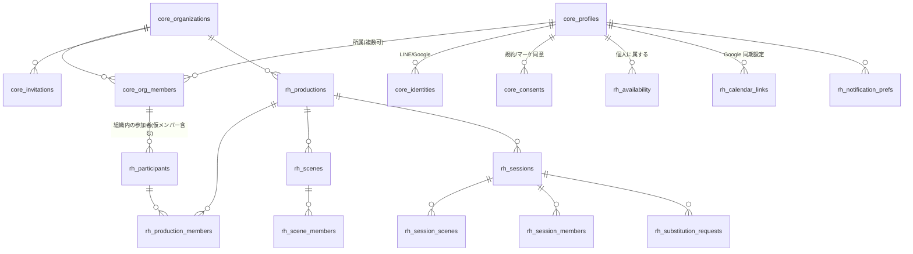

# 🎭 稽古・シフト管理サービス 要件定義書（v0.2 ドラフト）

> 小劇場（イマーシブ演劇を含む）の稽古・出演シフトを、主催者とキャストの双方が一元的に把握するためのサービスの要件。
>
> **v0.2 の位置づけ**: v0.1 は「自劇団向けの社内ツール」として設計・実装した。v0.2 では **不特定の主催者が自分で登録して無料で使える SaaS** に改め、**将来のチケット販売・物販管理システムと共通のアカウント**で利用できることを前提に要件を見直す。共通アカウント基盤そのものの設計は `docs/account-platform.md` に分離した。
>
> 作成日: 2026-09-13 ／ 更新日: 2026-09-13 ／ ステータス: **v0.2 確定・フェーズ A〜C 実装済み**（8.2 の Q15〜Q28 は回答を反映。8.3 に決定事項を要約）

## v0.1 → v0.2 の主な変更点

| 観点 | v0.1（実装済み） | v0.2（本書） |
|---|---|---|
| 利用者 | 自劇団のみ。組織は固定 1 件 | 誰でも主催者として登録できる。組織は無制限 |
| アカウント | 主催者が管理画面でメール＋初期パスワードを発行 | 本人がセルフサインアップ。主催者は招待するだけ |
| 1 人の所属 | 1 アカウント = 1 組織 = 1 ロール | 1 アカウントで複数組織に所属（キャストは複数劇団を渡り歩く） |
| メンバーの実体 | 組織内の `rh_members` 行 | 個人 = 共通アカウント。組織ごとの「参加者」がそれを参照 |
| 空き時間・連携設定 | 組織内メンバーに紐づく | 個人（アカウント）に紐づき、全組織で共通利用 |
| 料金 | 想定なし | **完全無料**。アカウント獲得のフックと位置づける |
| 通知コスト | 考慮なし | LINE プッシュの従量課金を前提に、チャネル設計を見直す（5.8） |
| 法務・運用 | 不要 | 利用規約・プライバシーポリシー・退会・不正対策が必須（5.10 / 5.11） |

# 1. 背景と目的

## 1.1 解決したい課題（v0.1 から継続）

小劇場では一人のキャストが**複数の公演に同時並行で関わる**のが常態化している。主催者は「誰がいつ稽古に来られるか」「どのシーンを稽古済みか」「あとどのシーンで全シーン一巡か」を把握できず、キャストは「今日どこに何時に行けばいいか」が分からなくなる。イマーシブ演劇のシフト制では急な出勤依頼も発生する。

## 1.2 事業上の位置づけ（v0.2 で追加）

- 本サービスは**完全無料**で提供し、**主催者・キャスト双方のアカウント獲得のフック**とする
- 将来、別途開発中の**チケット販売管理システム**（`docs/requirements.md`）および**事前物販・当日物販システム**と、**同一アカウント・同一組織**で利用できるようにする。稽古管理で組織とキャストの台帳ができていれば、チケットの「扱い」設定や物販のキャスト別集計はそのまま使える
- **キャスト側にネットワーク効果がある**点が重要。ある主催者が導入すると、その公演のキャスト全員がアカウントを持つ。そのキャストが次に関わる別劇団の主催者は「すでにキャストがアカウントを持っている」状態で招待されるため、導入障壁が下がる。主催者ではなく**キャストの体験を最優先**に設計する
- 成果指標（案）: 登録組織数、月間アクティブなキャスト数、1 キャストあたりの所属組織数、後続サービス（チケット・物販）への転換率

## 1.3 スコープ外（v0.2 時点）

- 台本・音源などのファイル共有、チャット（既存の LINE グループを置き換えない）
- ギャランティ・経費の計算（チケット・物販システムの領域。出演回数の読み取り専用ビューのみ将来提供）
- 劇団の公開ページ・集客機能

# 2. 解決すべきペインと解決方針

| # | ペイン | 解決方針 |
|---|---|---|
| R1 | 誰がいつ来られるか分からない | キャストが**空き時間を 1 か所に登録**し、所属する全組織の主催者がその判定結果だけを見られる。Google カレンダーからの自動取り込みで入力の手間を減らす |
| R2 | どのシーンを稽古済みか分からない | 稽古枠に「扱ったシーン」を記録。シーン別の稽古回数と**未消化シーン**を常時表示 |
| R3 | 今日来る人で何が稽古できるか判断できない | シーンごとに必要メンバーを定義し、出席予定から稽古可能なシーンを判定 |
| R4 | 急な出勤依頼が属人的 | **代役募集**を発行すると、そのシーンを演じられて空いている人へ一斉通知。先着で確定 |
| R5 | 今日どこへ行けばいいか分からない | **全組織横断**の個人予定ビュー。Google カレンダー同期と LINE で確認可能 |
| R6 | 情報が散在する | 主催者の稽古枠登録が唯一の正。カレンダー・LINE はそこからの配信 |
| R7（新） | 劇団ごとにアカウントや連絡先を作らされる | **1 人 1 アカウント**。LINE・Google 連携も 1 回設定すれば全組織で有効 |
| R8（新） | 主催者が「キャストのアカウント管理」までやらされる | 主催者は**招待リンクを配るだけ**。キャストが自分で登録・連携する |

# 3. 用語

| 用語 | 定義 |
|---|---|
| アカウント | 個人単位のログイン主体。1 メールアドレス = 1 アカウント。稽古管理・チケット・物販で共通（`docs/account-platform.md`） |
| 組織 | 劇団・制作団体・主催者の単位。稽古管理の**テナント境界**。組織間でデータは完全に分離される |
| 組織メンバーシップ | アカウントと組織の所属関係。ロール（owner / admin / member）と区分（cast / staff / director）を持つ。1 アカウントは複数組織に所属可 |
| 招待 | 主催者が発行する参加用リンク／QR。受け取った人がアカウントを作る（または既存アカウントで）と組織メンバーになる |
| 仮メンバー | 本人がまだ登録していない段階で、主催者が名前だけ登録した参加者。本人が招待から参加した時点でアカウントに紐づく（claim） |
| プロダクション | 組織内の稽古・本番の管理単位（v0.1 と同じ） |
| シーン／稽古枠／シフト／可用性／代役募集 | v0.1 と同じ |

# 4. ユーザーとロール

## 4.1 アカウントの種類

アカウントに種類はない。**主催者もキャストも同じアカウント**で、組織ごとのロールで振る舞いが決まる。同じ人が A 劇団では主催者（owner）、B 劇団ではキャスト（member）、というのが普通にある。

## 4.2 組織ロール

| ロール | できること |
|---|---|
| owner | 組織の設定変更・削除、admin の任命、支払い（将来の有料サービス）。組織に必ず 1 人以上 |
| admin（制作・演出・舞監） | プロダクション・シーン・稽古枠・参加者の全操作、進捗閲覧、代役募集、通知送信、招待発行 |
| member（キャスト・スタッフ） | 自分の予定閲覧、出欠回答、代役応募、可用性登録、連携設定。区分（cast / staff / director）は表示と召集対象の絞り込みに使う |

## 4.3 情報分離要件

- **組織間**: 完全分離。他組織のプロダクション・稽古枠・参加者は一切見えない
- **個人データ**: 空き時間、外部カレンダーの予定、LINE・Google の連携情報は**アカウントに属し、どの組織にも属さない**。組織の主催者が見られるのは「その稽古枠の時間帯に来られるか」の**判定結果**（可／不可／他現場／未回答）のみ。他現場の内容（どの劇団の何か）は見せない
- **組織内**: 同じ稽古枠に召集されたメンバー同士は互いの出欠を見られる。他人の可用性の詳細は見られない
- 主催者が退会・離脱しても組織データは残る（owner の移譲、8.2 Q26）

# 5. 機能要件

## 5.0 アカウント・組織・招待（v0.2 で追加）

**サインアップ／ログイン**
- メールアドレス＋パスワード、Google ログイン、LINE ログインに対応する。**キャストには LINE ログインを第一導線**にする（普段使うアプリで完結し、LINE 通知の連携も同時に済む）
- メール確認（またはソーシャルログイン）を完了しないと組織の作成・参加はできない（不正登録対策）
- プロフィール: 表示名（芸名可）、区分の既定値、通知チャネルの希望

**組織の作成**
- ログイン後、誰でも組織を作成できる（審査なし。8.2 Q21）。作成者が owner になる
- 組織名、種別（劇団／制作会社／個人主催／その他）、活動地域（任意）を登録

**招待と参加**
- admin が**招待リンク／QR**を発行（有効期限・使用回数・付与ロールを指定）。LINE グループに貼るだけで配布できる
- 受け取った人はリンクを開き、ログイン（未登録なら登録）すると組織メンバーになる。**参加時に区分（キャスト等）と役名を自己申告**し、admin が後から修正できる
- 主催者が先に**仮メンバー**（名前のみ）を登録してシーンや稽古枠を組めるようにし、本人が参加した時に「あなたはこの仮メンバーですか？」と紐づけを提案する（admin 側からの紐づけも可）
- 組織からの離脱（本人）と除名（admin）。離脱後も過去の出欠記録は組織に残る

**複数組織**
- `/me` の予定ビューは全組織横断。組織ごとの画面（主催者機能）は組織切替で移動する
- 組織に属さないアカウントも存在できる（招待待ちのキャスト）

**退会**
- 本人がアカウントを削除できる。削除時は個人データ（可用性・連携）を即時削除し、組織側の記録は「退会済みユーザー」として匿名化する（8.2 Q25）
- 自分のデータのエクスポート（予定・出欠の CSV）

## 5.1 プロダクション・参加者管理（admin）

v0.1 と同じ。ただし「メンバー登録」は「招待」に置き換わり、**参加者 = 組織メンバーシップ**を参照する。仮メンバーの作成のみ admin が名前を直接入力する。

## 5.2 シーン管理と稽古進捗

v0.1 と同じ。

## 5.3 可用性（空き時間）の収集

- 可用性は**アカウント単位**で 1 セット。所属する全組織の判定に使われる
- 稽古枠の作成前チェックと可用性マトリクスは v0.1 と同じ。ただし他組織の予定は「他現場」とだけ表示する（4.3）
- 初回利用時に「あなたの空き時間は、所属するすべての劇団の主催者に『来られる／来られない』としてだけ共有されます」と明示して同意を得る（8.2 Q24）

## 5.4 稽古枠の作成・召集・出欠

v0.1 と同じ。

## 5.5 本番シフトと急な出勤依頼

v0.1 と同じ。代役候補の空き判定に他組織の予定も使われる（内容は見せない）。

## 5.6 「今日どこへ行く」個人ビュー

v0.1 と同じ。**全組織横断**であることが本サービスの中核価値。組織名を必ず表示する。

## 5.7 Google カレンダー連携

v0.1 で実装済み（iCal 購読と Calendar API 同期の両方）。v0.2 では **アカウント単位**の設定になる（1 回連携すれば全組織の召集が同期される）。

- Google Cloud の OAuth 同意画面審査は**サービス提供者（PUZZLIAR）が 1 回**行えばよい。審査完了前はテストユーザー 100 名までの制限があるため、クローズド β の間に審査を通す（8.2 Q22）

## 5.8 LINE 連携（v0.2 で設計を見直し）

**前提となるコスト構造**（LINE 公式アカウントの料金。数値は要再確認 → 8.2 Q19）
- 友だち追加・**返信メッセージ（ユーザーからの送信に対する reply）は無料・無制限**
- **プッシュメッセージは月あたりの無料枠を超えると従量課金**。無料プランの無料枠は月 200 通程度で、それ以上は有料プラン（月額数千円〜、通数上限あり）
- 無料サービスとして不特定多数に提供する場合、v0.1 の設計（毎朝ダイジェスト・前日リマインド・召集・変更・代役をすべてプッシュ）は**利用者が増えるほど提供者のコストが増える**

**v0.2 の方針（提案）**
1. **LINE ログイン**をアカウントの主要な登録・ログイン手段にする（無料）。これによりキャストの LINE userId が自然に取得でき、v0.1 の「6 桁コードで連携」は不要になる
2. **問い合わせ型（reply）は制限なく提供**する: 「今日」「今週」「参加」「不参加」「入れます」は v0.1 のまま
3. **プッシュは「本人が動かないと困るもの」に限定**する: 召集（初回のみ）、変更・中止、代役募集・確定。毎朝ダイジェストと前日リマインドは**メールまたは Web プッシュ**を既定にし、LINE プッシュは本人が明示的に選んだ場合のみ
4. **Web プッシュ（PWA）**を通知チャネルに追加する。無料で、iOS もホーム画面追加で対応可能
5. **通知チャネルの希望を本人が設定**する（LINE／メール／Web プッシュ、種類ごと）
6. 将来、組織が**自前の LINE 公式アカウントを接続**できるようにする（Bring Your Own Channel）。組織のプッシュ費用は組織持ちになり、劇団名で通知が届く。v0.2 のスコープ外だがデータモデルは組織ごとのチャネル設定を許容する

**LINE グループ**への投稿は引き続き行わない。

## 5.9 通知ポリシー

- 通知の種類ごとに既定チャネルを持つ（5.8）。本人の設定が優先
- 同じ内容は二重送信しない（dedupe）。深夜帯（22:00〜7:00）は緊急の代役募集を除き送らない
- 組織あたり・アカウントあたりの**プッシュ通知の上限**を設け、超過分はメールにフォールバックする（コスト防衛。8.2 Q20）

## 5.10 無料提供に伴う制限と不正対策（v0.2 で追加）

- **機能の制限はしない**（完全無料でフル機能）。ただし乱用防止のため次のガードレールを置く
  - 組織作成: 1 アカウントあたり上限（例: 10）、メール確認必須
  - 招待リンク: 有効期限（既定 14 日）・使用回数上限。無効化可能
  - 通知: 送信レート制限（5.9）
  - 1 組織のメンバー数・プロダクション数に緩い上限（例: 500 名・100 件。超えたら問い合わせ）
- 長期間（例: 18 か月）活動のない組織は事前通知の上でアーカイブ
- 無料であることと、将来の有料サービス（チケット・物販）は別である旨を規約に明記。**稽古管理を後から有料化するかどうか**は 8.2 Q18

## 5.11 利用規約・プライバシー（v0.2 で追加）

- 利用規約・プライバシーポリシーへの同意を登録時に取得（バージョン管理し、改定時は再同意）
- 収集する個人データ: メールアドレス、表示名、LINE userId、Google のメールとカレンダーへのアクセストークン（暗号化保存）、空き時間、出欠記録
- **後続サービス（チケット・物販）の案内を送るためのマーケティング同意**は規約同意とは別チェックで取得する（8.2 Q23）
- Google Calendar API の利用は Google の API サービス ユーザーデータポリシー（限定的使用の要件）に従う旨をプライバシーポリシーに明記する（審査で必須）
- データ保持: 退会後 30 日で個人データを完全削除。組織データは組織が削除するまで保持
- 問い合わせ窓口・運営者表示（特商法表示は無料サービスのため不要だが、運営者情報は掲載する）

# 6. 非機能要件

- **テナント分離を DB 層で強制する**。v0.1 は service role でクエリしてアプリ側でロール確認する方式だったが、不特定多数の組織を扱うため、**組織メンバーシップに基づく RLS を必須**とし、アプリ側の実装漏れが情報漏えいにならないようにする。管理系のクエリは「ログインユーザーの権限で動く Supabase クライアント」から発行し、service role は Webhook・cron・トークン処理に限定する
- 共通アカウント基盤（`docs/account-platform.md`）の上に構築する。稽古管理固有のテーブルは `rh_` のまま、組織・アカウント・所属・招待は `core_` を参照する
- 日時は UTC 保存・Asia/Tokyo 表示（当面は日本国内向け。タイムゾーン設定は将来）
- スマートフォン第一。PWA としてホーム画面に追加でき、Web プッシュを受け取れる
- 監査ログ: 組織設定・メンバーシップ・招待・削除系の操作を記録
- 可用性: 単一リージョン（Supabase 東京）＋ Vercel。無料サービスとして SLA は設けないが、稽古当日に見られないと致命的なので、iCal と LINE 返信のような**読み取り経路を複数**持つ
- 個人データ削除・エクスポートを仕様として持つ（5.0）

# 7. ドメインモデル（v0.2）

共通アカウント基盤（`core_`）の上に稽古管理（`rh_`）が乗る。詳細な DDL は実装フェーズで `docs/account-platform.md` の設計に従って確定する。

v0.1 からのモデル変更点:
- `rh_members`（組織内の人物）を、**個人 = `core_profiles`** と **組織内の参加者 = `rh_participants`**（`org_id`, `profile_id` nullable、`display_name`）に分割する。仮メンバーは `profile_id = null` の参加者
- `rh_availability`、Google 連携、LINE 連携、通知設定は `profile_id` に付け替える（組織をまたいで共通）
- `rh_session_members` は参加者を参照。個人予定ビューは「自分の profile に紐づく参加者」を全組織分集めて構成する
- `org_id` の固定値（`ORG_ID` 定数）は廃止し、すべての操作で**リクエストの組織コンテキスト**を明示する

# 8. 質問事項と提案

## 8.1 v0.1 からの継続（回答待ち）

| # | 質問 | 暫定採用 |
|---|---|---|
| Q1 | 稽古の単位はシーンで足りるか（ルート・役の組み合わせ） | シーンのみ。v0.3 でタグ |
| Q2 | 本番シフトは本システムで組むか外部取り込みか | 本システムで組む |
| Q3 | 代役の確定ルールは先着か承認か | 先着即確定（admin が手動確定・取消可） |
| Q4 | 可用性の粒度・繰り返し | 時間帯。繰り返しは v0.3。Google 取り込みで入力を減らす |
| Q5 | 他組織の予定をどこまで見せるか | 「他現場」として時刻のみ（v0.2 で確定扱いとし 4.3 に記載） |
| Q6 | 本システム外の予定の扱い | Google カレンダー取り込みで代替（実装済み） |
| Q7 | Google 連携の方式 | iCal + API の両方（実装済み）。審査は 8.2 Q22 |
| Q8 | 通知の時間帯ルール | 毎朝 8:00・前日 20:00・22〜7 時抑止 |
| Q9 | LINE グループへの告知 | 行わない |
| Q10 | 稽古場マスタ | 自由記述。v0.3 でマスタ化 |
| Q11 | 必要メンバーの必須／任意 | 召集ごとに必須フラグ |
| Q12 | 稼働制限の可視化 | 個人ビューに「今週 N 件」 |
| Q13 | ギャランティ連携（出演回数） | 将来、読み取り専用ビューで提供 |
| Q14 | マルチテナント・複数組織所属 | **v0.2 で「対応する」に確定**。本書全体がその前提 |

## 8.2 v0.2 で新たに生じた質問

| # | 質問 | 選択肢・提案 | 暫定採用 |
|---|---|---|---|
| Q15 | **サービス名とブランド**。PUZZLIAR 名義で出すか、稽古管理として独立した名前を付けるか。ドメインは `rehearsal.puzzliar.jp` のようなサブドメインか独自ドメインか | (a) PUZZLIAR のサブブランド (b) 独立ブランド | (a)。共通アカウントの名称も「PUZZLIAR ID」を仮称とする |
| Q16 | **対象ジャンル**。小劇場演劇に限定するか、ダンス・音楽・イマーシブイベント・アイドル現場など「複数現場を掛け持ちする出演者」全般を対象にするか | (a) 小劇場演劇に絞る (b) 舞台芸術全般 (c) 出演者を伴う現場全般 | (b)。用語は演劇寄り（シーン・稽古）のままにし、文言のカスタマイズは v0.3 |
| Q17 | **ログイン方式の優先順位**。LINE ログインを主導線にしてよいか（LINE を使わないキャスト・海外キャストへの配慮） | (a) LINE 主・メール従 (b) メール主・LINE/Google 従 (c) Google 主 | (a)。メールと Google も常に提供 |
| Q18 | **「完全無料」の範囲と将来**。稽古管理を永久無料と明言するか、将来有料機能（組織向け高度機能など）を残すか | (a) 永久無料と明言 (b) 「基本機能は無料」と表現し余地を残す | (b)。規約上は「基本機能を無料で提供。将来の有料機能追加時は事前告知」 |
| Q19 | **LINE プッシュ通知のコスト負担**。5.8 の方針（プッシュ限定＋メール／Web プッシュ既定）でよいか。提供者側で月額いくらまで許容するか | (a) 提案どおり (b) すべて LINE プッシュ（コストは提供者持ち、上限で打ち切り） (c) 組織ごとに自前の LINE 公式アカウントを接続（BYO） | (a)。(c) は v0.3 候補。**LINE 公式アカウントの現在の料金・無料枠を確認**して上限を決める |
| Q20 | **通知の上限値**。アカウント・組織あたりの月間 LINE プッシュ上限をいくつにするか | 提案: アカウントあたり月 30 通、組織あたり月 500 通。超過はメール | 提案どおり。運用データで見直す |
| Q21 | **主催者登録の審査**。誰でも即時に組織を作れてよいか。なりすまし劇団・スパム招待への対策として何を求めるか | (a) 審査なし（メール確認のみ） (b) 招待制（既存ユーザーの紹介） (c) 事後審査 | (a) ＋ 5.10 のガードレール。クローズド β の間は (b) |
| Q22 | **Google OAuth 審査の担当と時期**。`calendar.events` は機微スコープで審査に数週間かかる。誰が Google Cloud プロジェクトを持つか | 提案: PUZZLIAR が保有し、β 開始時に審査申請。プライバシーポリシー URL・デモ動画が必要 | 提案どおり |
| Q23 | **マーケティング同意**。後続サービス（チケット・物販）の案内をどう送るか。登録時のオプトインか、稽古管理内でのお知らせ表示か | (a) 登録時オプトイン＋メール (b) サービス内お知らせのみ (c) 両方 | (c)。オプトインは既定オフ |
| Q24 | **空き時間の組織間共有の同意**。可用性が所属全組織の判定に使われることをどう説明・同意取得するか。組織ごとに共有可否を選ばせるか | (a) 全組織共通（明示同意のみ） (b) 組織ごとに ON/OFF | (a)。(b) は要望があれば v0.3 |
| Q25 | **退会時の記録の扱い**。退会したキャストの過去の出欠記録を組織に残すか（匿名化するか） | (a) 名前を残す (b) 「退会済みユーザー」に匿名化 (c) 組織が選ぶ | (b) |
| Q26 | **owner の離脱・連絡不能時の組織移譲**。owner が唯一の admin で退会した場合、組織をどうするか | (a) 削除 (b) 他の admin へ自動移譲、いなければ凍結 (c) 運営が手動対応 | (b) |
| Q27 | **既存チケットシステムの移行順序**。現在の `tk_app_users`（1 ユーザー 1 組織）を共通アカウント基盤に乗せ換えるのを、稽古管理の公開前に行うか後にするか | (a) 先に基盤を作り両方を乗せる (b) 稽古管理を先に公開し、チケットは後で移行 | (a)。基盤は小さく（`docs/account-platform.md`）、チケット側の改修は `tk_app_users` を基盤参照のビューに置き換える程度に留める |
| Q28 | **サポート体制**。問い合わせ窓口（メール／フォーム）、対応時間、稽古当日の緊急時対応をどう表現するか | 提案: フォーム＋メール、ベストエフォート。ステータス表示ページを用意 | 提案どおり |

## 8.3 決定事項（2026-09-13 回答）

| # | 決定 |
|---|---|
| Q15 | PUZZLIAR のサブブランド。共通アカウントは「PUZZLIAR ID」（仮称） |
| Q16 | 小劇場演劇とイマーシブシアター公演をメインターゲット。ダンス・音楽での利用も可。用語は演劇寄り |
| Q17 | **Google ログインがメイン**。LINE ログインはオプション（実装済み・環境変数で有効化）。メール＋パスワードも提供 |
| Q18 | 「基本機能は無料」と表現し、将来の有料機能の余地を残す（規約 4 条） |
| Q19/Q20 | **無料でできる範囲で実装**: メール・Web プッシュ・LINE 返信は制限なし。LINE プッシュは全体で月 200 通（`LINE_PUSH_MONTHLY_LIMIT`）を上限とし、超過分は次のチャネルへ |
| Q21 | **当面は招待制**。組織作成には運営が発行する主催者コードが必要（`ORG_CREATION_OPEN=true` で解除） |
| Q22 | 未定 → 9.1 にスケジュール案を記載 |
| Q23 | 登録時（オンボーディング）に任意のオプトイン＋サービス内お知らせ |
| Q24 | 全組織共通。オンボーディングで明示同意を取得 |
| Q25 | **匿名化**（「退会済みユーザー」）。個人データは即時削除 |
| Q26 | 他の admin へ自動移譲、いなければ組織を凍結 |
| Q27 | **共通基盤に組み込んだ稽古管理だけを先に出す**。チケット（`tk_`）は当面そのまま。`tk_organizations` の PUZZLIAR は同一 UUID で `core_organizations` に複製済み |
| Q28 | フォーム＋メール、ベストエフォート |
| A1 | LINE ログインは LINE Login v2.1（OIDC）を自前実装。Supabase セッションは magiclink の token_hash 検証で発行 |

# 9. 段階計画（v0.2）

| フェーズ | 内容 | 依存 |
|---|---|---|
| **A. 共通アカウント基盤とマルチテナント化** | `core_` テーブル群、組織メンバーシップに基づく RLS、`ORG_ID` 定数の廃止、`rh_members` の分割（個人／参加者）、チケットの `tk_app_users` の基盤参照化 | `docs/account-platform.md` の確定、Q27 |
| **B. セルフサインアップ・招待・オンボーディング** | メール／Google／LINE ログイン、組織作成、招待リンク／QR、仮メンバーの紐づけ、組織切替、規約同意・退会・エクスポート | Q15, Q17, Q21, Q23〜Q26 |
| **C. 通知チャネルの再設計** | 通知設定、Web プッシュ（PWA）、LINE プッシュの限定と上限、メールのテンプレート整備 | Q19, Q20 |
| **D. クローズド β** | 数劇団で運用。Google OAuth 審査、LINE 公式アカウントの本番設定、利用規約・プライバシーポリシー公開 | Q22 |
| **E. 一般公開** | 審査なし登録の開放、ランディングページ、サポート窓口 | Q18, Q28 |
| **F. 後続サービス接続** | チケット販売・物販での共通アカウント利用、稽古管理の組織・キャスト台帳をチケットの扱い設定へ流用、出演回数ビュー | チケット・物販側の進捗 |

v0.1 で実装した機能（シーン進捗、稽古枠、可用性、代役、Google 同期、LINE 応答）はフェーズ A の改修を経てそのまま活きる。

**進捗（2026-09-13 時点）**: フェーズ A・B・C を実装済み（本ブランチ）。フェーズ D（クローズド β）は環境設定と外部サービスの申請待ち。

## 9.1 Google OAuth 審査のスケジュール案（Q22）

Google Calendar API の `calendar.events` / `calendar.freebusy` は機微スコープのため、OAuth 同意画面の審査（ブランド確認＋機微スコープ確認）が必要。審査前は「テスト」状態で最大 100 名のテストユーザーまで利用できる。

| 週 | 作業 | 担当 |
|---|---|---|
| 第 1 週 | Google Cloud プロジェクト作成、OAuth クライアント（Web）作成、リダイレクト URI 登録、`GOOGLE_CLIENT_ID/SECRET` を Vercel に設定。同意画面を「テスト」で公開し、β 参加者をテストユーザーに登録 | PUZZLIAR |
| 第 1〜2 週 | 本番ドメインで利用規約・プライバシーポリシーを公開（本リポジトリの `/terms` `/privacy` を法務レビュー後に確定）。ホームページにアプリの説明と Google データの利用目的を明記 | PUZZLIAR |
| 第 2 週 | 審査申請に必要な**デモ動画**（連携→予定登録→FreeBusy 取り込み→解除の一連）を撮影。申請フォームに「限定的使用」への準拠を記載 | PUZZLIAR |
| 第 2〜3 週 | ブランド確認（ドメイン所有権の証明。Search Console でのドメイン確認） | PUZZLIAR |
| 第 3〜8 週 | 機微スコープの審査（通常 2〜6 週間）。指摘があれば修正して再提出 | PUZZLIAR / 開発 |
| 審査完了後 | 同意画面を「本番」へ。テストユーザー上限が外れ、一般公開（フェーズ E）が可能に | PUZZLIAR |

審査を待たずに始められるよう、β 期間中は **テストユーザー登録（100 名）＋ iCal 購読のフォールバック** で運用する。テストユーザーの refresh token は 7 日で失効する点に注意（失効時に連携を解除して再連携を促す処理は実装済み）。

LINE 側は審査不要。LINE Developers でプロバイダーを 1 つ作り、その配下に「LINE ログイン」チャネルと「Messaging API」チャネルを作成すれば、同じ userId で紐づく。

# 10. 現行実装（v0.1）からの改修項目

| 領域 | 現状 | 改修 |
|---|---|---|
| 組織 | `ORG_ID` 定数で固定 | 廃止。URL（`/o/[orgSlug]/...`）またはセッションの組織コンテキストから解決 |
| 認証・ロール | `tk_app_users`（1 ユーザー 1 組織 1 ロール）を `getAppUser()` で参照 | `core_org_members` を参照する `getOrgUser(orgId)` に置換。`requireRole` は組織スコープ付きに |
| メンバー | `rh_members`（組織内人物。user_id・LINE・Google・iCal トークンを保持） | 個人情報は `core_profiles` / `core_identities` へ移動。`rh_participants`（org_id, profile_id nullable, display_name）に縮小 |
| メンバー登録 | admin がメール＋パスワードで発行 | 廃止。招待リンクと仮メンバー作成に置換 |
| 可用性・Google 同期・通知ログ | `member_id` 参照 | `profile_id` 参照へ変更 |
| RLS | 定義済みだが service role 経由のため未使用 | ユーザー権限クライアントで実クエリ。ポリシーを組織メンバーシップ基準に書き直し |
| LINE 連携 | 6 桁コードで userId を紐づけ | LINE ログイン（`core_identities`）に統合。Webhook の本人特定は `core_identities` を参照 |
| 通知 | 全種別 LINE プッシュ優先 | 種別ごとの既定チャネルと本人設定、上限とメールフォールバック |
| 画面 | `/admin/rehearsal/...`、`/me` | `/o/[org]/...`（主催者）、`/me`（個人・全組織横断）、`/join/[token]`（招待）、`/onboarding` |
| 法務 | なし | 規約・プライバシーポリシー・同意記録・退会・エクスポート |

上記はすべて実装済み（マイグレーション `core_platform_rehearsal_v2` を Supabase に適用済み。`rh_` v1 テーブルは未使用だったため作り直した）。

# 11. 実装状況と環境設定（v0.2）

| パス | 対象 | 内容 |
|---|---|---|
| `/rehearsal` | 公開 | サービス紹介 |
| `/signup` `/login` `/auth/callback` | 全員 | メール／Google／LINE（任意）での登録・ログイン |
| `/auth/line` `/auth/line/callback` | 全員 | LINE ログイン（自前 OIDC） |
| `/onboarding` | 全員 | 表示名・規約同意・空き時間共有の同意・マーケティング同意 |
| `/me` `/me/settings` | 本人 | 全組織横断の予定、出欠、代役応募、空き時間、通知設定、LINE／Google 連携、Web プッシュ、iCal、エクスポート、退会 |
| `/orgs/new` | 主催者 | 組織作成（招待制: 主催者コード必須） |
| `/join/[token]` | 招待された人 | 招待の受諾（未登録なら登録へ） |
| `/o/[slug]` 以下 | 組織 | プロダクション／シーン進捗／稽古枠／出欠・実施記録／代役募集／空き時間マトリクス／メンバー・招待・参加者台帳／設定 |
| `/platform` | 運営 | 主催者コード発行、組織の凍結・有効化 |
| `/terms` `/privacy` | 公開 | 規約・プライバシーポリシー（ドラフト。法務レビュー前） |
| `/api/ical/[token]` `/api/google/*` `/api/line/webhook` `/api/push/subscribe` `/api/me/export` `/api/cron/rehearsal-notify` | 連携 | v0.1 と同様（個人単位に変更） |

環境変数（`.env.example`）: 既存に加え `ORG_CREATION_OPEN`、`LINE_LOGIN_CHANNEL_ID/SECRET`、`NEXT_PUBLIC_LINE_LOGIN_ENABLED`、`LINE_PUSH_MONTHLY_LIMIT`、`NEXT_PUBLIC_VAPID_PUBLIC_KEY`、`VAPID_PRIVATE_KEY`、`VAPID_SUBJECT`。

運用開始前に必要なこと: Supabase Auth の Google プロバイダ（設定済み）とメール確認の設定、Resend の送信ドメイン、VAPID 鍵の生成、LINE チャネル、Google OAuth（9.1）、規約・ポリシーの法務レビュー、外部スケジューラで `/api/cron/rehearsal-notify` を定期実行。
