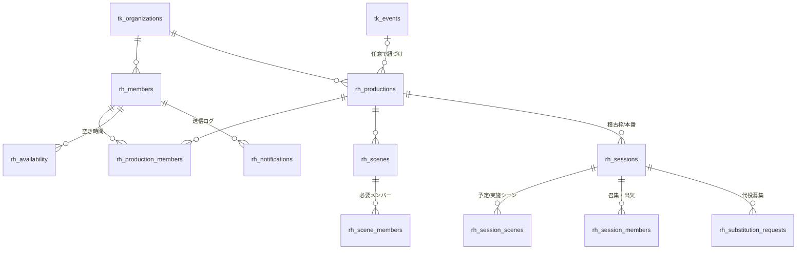

# 🎭 稽古・シフト管理システム 要件定義書（v0.1 ドラフト）

> 小劇場（特にイマーシブ演劇を含む）の稽古・出演シフトを、主催者とキャストの双方が一元的に把握するためのシステムの要件を整理したもの。既存のチケット販売管理システム（`docs/requirements.md`）と同一リポジトリ・同一 Supabase プロジェクト上に構築し、公演（`tk_events`）・アカウント（`tk_app_users`）を共有する。
>
> 作成日: 2026-09-13 ／ ステータス: ドラフト（**8章の質問事項への回答待ち**。回答があるまでは 8章の「暫定採用」欄の前提で実装を進める）

# 1. 背景と目的

小劇場では一人のキャストが**複数の公演に同時並行で関わる**のが常態化している。ある公演の本番に出演しながら別公演の稽古に通う、といった状況で、以下の問題が起きている。

**主催者（興行主・演出・制作）側**
- 誰が・いつ稽古に来られるのかが把握できず、日程調整が LINE グループでの「◯日空いてる人？」の応酬になる
- どのシーンを何回稽古したか、**あとどのシーンをやれば全シーン一巡するか**が頭の中と紙にしかない
- 出演者の都合で急遽シーンを差し替える判断に必要な情報（今日来られる人で稽古できるシーン）が即座に出ない

**キャスト側**
- イマーシブ演劇は**シフト制**（回替わりで出演者が入れ替わる）が多く、他キャストの体調不良等で**急な出勤依頼**が来る
- 複数現場に関わっていると「**今日はどこに何時に行けばいいのか**」が分からなくなる
- 情報が公演ごとに別々の LINE グループ・スプレッドシート・口頭に散っていて、自分の予定を一つの場所で見られない

本システムは、**稽古枠・出演シフト・シーン進捗・各人の空き時間**を一元管理し、キャストは普段使っている **Google カレンダーと LINE** で確認・返答できるようにする。

# 2. 解決すべきペインと解決方針

| # | ペイン | 解決方針 |
|---|---|---|
| R1 | 誰がいつ来られるか分からない | キャストが**空き時間（可用性）を事前登録**。主催は日付・時間帯を指定すると「来られる人・来られない人・他現場と被る人」が一覧で見える |
| R2 | どのシーンを稽古済みか分からない | 稽古枠に「**扱ったシーン**」を記録。シーンごとの稽古回数と**未消化シーン一覧**を常時表示（目標回数に対する進捗） |
| R3 | 今日来る人で何が稽古できるか判断できない | シーンごとに必要メンバーを定義。稽古枠の出席予定から「**今日稽古可能なシーン**」を自動判定 |
| R4 | 急な出勤依頼が属人的 | **代役募集**を発行すると、そのシーン／役を演じられるメンバーのうち空いている人へ LINE で一斉通知。先着で確定し、確定後は他の候補者へ「埋まりました」と通知 |
| R5 | 今日どこへ行けばいいか分からない | キャスト個人の「**今日・今週の予定**」を全公演横断で表示。同じ内容を Google カレンダー購読と LINE の毎朝配信・「今日」と送るだけの問い合わせで確認可能 |
| R6 | 情報が散在する | 主催者の稽古枠登録が**唯一の正**。カレンダー・LINE はそこから配信される「ビュー」であり、二重入力を発生させない |

# 3. 用語

| 用語 | 定義 |
|---|---|
| プロダクション | 稽古・本番の管理単位。チケットシステムの公演（`tk_events`）に任意で紐づけられる（紐づけない稽古のみのプロジェクトも可） |
| メンバー | 稽古・本番に参加する人（キャスト／スタッフ／演出）。**公演をまたいで同一人物は 1 レコード**。ログインアカウント・LINE を紐づける |
| シーン | 稽古の最小単位。「1幕3場」「オープニング」「ルート B 序盤」など。**必要メンバー**を持つ |
| 稽古枠（セッション） | 日時・場所・対象シーン・召集メンバーを持つ予定。種別は「稽古」「本番（シフト）」「その他（顔合わせ・場当たり等）」 |
| シフト | 本番回への出演割当。稽古枠の種別 = 本番 として同じ仕組みで扱う |
| 可用性（空き時間） | メンバーが自己申告する「この時間帯は参加できる／できない」 |
| 代役募集 | ある稽古枠・本番回に欠員が出た際、代わりに入れる人を募る依頼 |

# 4. ユーザーとロール

既存の `tk_app_users.role`（admin / staff / cast）を流用する。

| ロール | 稽古管理での権限 |
|---|---|
| admin（主催・制作・演出） | プロダクション・シーン・稽古枠・メンバーの全操作、進捗閲覧、代役募集の発行、通知送信 |
| cast / staff（メンバー） | 自分の予定閲覧、召集への出欠回答、可用性登録、代役募集への応募、LINE・カレンダー連携設定。**他メンバーの可用性・他公演の予定は見えない**（同じ稽古枠に召集されているメンバー名は見える） |

# 5. 機能要件

## 5.1 プロダクション・メンバー管理（admin）

- プロダクションの作成（名称・稽古開始日・初日・既定の稽古場所・チケット公演との紐づけ）
- メンバーの登録（氏名・区分・ログインアカウント紐づけ）。メンバーは組織内で一意で、複数プロダクションに参加できる
- プロダクションへの参加登録（役名・区分）

## 5.2 シーン管理と稽古進捗

- シーンの登録（コード・名称・並び順・目標稽古回数・必要メンバー）
- 稽古枠に「予定シーン」を設定し、稽古後に「実施済み／未実施（スキップ）」を記録
- プロダクション画面に**シーン別進捗表**（実施回数／目標回数・最終稽古日・**未消化シーン**の強調）を表示
- 「全シーン一巡までの残り」を件数で表示

## 5.3 可用性（空き時間）の収集

- メンバーは「日付・開始・終了・参加可／不可・メモ」を登録（繰り返しは v0.1 では扱わない → 8章 Q4）
- admin は週単位の**可用性マトリクス**（メンバー × 日）を閲覧。同時刻に他プロダクションの稽古枠へ召集済みの場合は「他現場」として表示
- 稽古枠の作成フォームで日時とシーンを指定すると、**必要メンバーごとの参加可否**（可／不可／他現場と重複／未回答）を作成前に確認できる

## 5.4 稽古枠の作成・召集・出欠

- 稽古枠の作成（種別・タイトル・日時・場所・メモ・予定シーン）。予定シーンから必要メンバーを自動召集（手動追加・除外も可）
- 召集されたメンバーへ LINE（未連携ならメール）で通知。メンバーは「参加／不参加／未定」を回答
- 稽古枠の変更（日時・場所）・中止時は召集メンバーへ再通知
- 当日は admin が出席（出席／欠席／遅刻）を記録
- 稽古枠の「完了」で実施シーンを確定し、進捗へ反映

## 5.5 本番シフトと急な出勤依頼

- 本番回は種別 = 本番 の稽古枠として登録。シフト表 = 本番回 × 出演メンバーの一覧
- 欠員が出たら admin が**代役募集**を発行（欠ける人・理由）。候補者は「欠ける人が担当するシーンを演じられるメンバー」のうち、同時刻に不可・他現場でない人。全員へ LINE 一斉通知
- 候補者は LINE またはアプリから「入れます」を送信。**先着 1 名で確定**し、他の候補者へ「埋まりました」を通知。admin が手動で確定することも可能
- 確定した代役はその稽古枠の召集メンバーに追加され、カレンダー・LINE にも反映

## 5.6 「今日どこへ行く」個人ビュー（メンバー）

- ログイン後、今日・明日・今週の予定を**全プロダクション横断**で時系列表示（プロダクション名・種別・時刻・場所・対象シーン・出欠状態）
- 未回答の召集・募集中の代役依頼を上部に表示
- 可用性の登録、LINE 連携、カレンダー購読 URL の取得も同じ画面で行う

## 5.7 Google カレンダー連携

**方式 A（v0.1 で実装）: iCal 購読フィード**
- メンバーごとにシークレット URL（`/api/ical/{token}`）を発行。Google カレンダーの「URL で追加」で購読すると、召集された稽古枠・本番回（不参加回答分を除く）が自分のカレンダーに表示される
- 予定の変更・中止はフィード側に反映される（Google 側の再取得間隔に依存。**数時間〜最大 1 日程度の遅延**がある点に注意 → 8章 Q7）
- Google 以外（Apple／Outlook カレンダー）でも同じ URL で購読可能

**方式 B（v0.2 候補）: Google Calendar API による即時同期**
- メンバーが Google アカウントで OAuth 認可し、本システムが直接予定を作成・更新・削除する。反映は即時。中止も即時に消える
- 加えて **空き時間の自動取り込み**（FreeBusy 読み取り）が可能になり、キャストの可用性登録の手間を減らせる（他の予定は「予定あり」としか扱わず、内容は読まない）
- Google Cloud プロジェクトの作成・OAuth 同意画面の審査（機微スコープ）が必要

## 5.8 LINE 連携

LINE 公式アカウント（Messaging API）を使う。個人の LINE アカウントに友だち追加してもらい、アプリで発行する 6 桁コードを LINE で送信すると本人と紐づく。

**プッシュ通知（システム → メンバー）**
| タイミング | 内容 |
|---|---|
| 毎朝 定時（暫定 8:00） | 「今日の予定」ダイジェスト（予定がない日は送らない） |
| 稽古枠に召集されたとき | 日時・場所・シーン、「参加／不参加」の返答方法 |
| 稽古枠の変更・中止 | 変更内容 |
| 予定の開始 前日 20:00（暫定） | リマインド |
| 代役募集 | 候補者へ一斉通知。「入れます」で応募 |
| 代役確定 | 確定者へ確定通知、他候補者へ「埋まりました」 |

**問い合わせ（メンバー → システム）**
| メッセージ | 返答 |
|---|---|
| 今日 ／ 明日 ／ 今週 | 該当期間の予定一覧 |
| 参加 ／ 不参加 | 直近の未回答召集に対する回答（複数ある場合は番号で選択） |
| 入れます | 募集中の代役に応募 |
| 連携 123456 | アカウント連携 |
| ヘルプ | コマンド一覧 |

LINE グループへの投稿（グループ全体への告知）は v0.1 では行わない（→ 8章 Q9）。

## 5.9 通知ポリシー

- 同じ内容は二重送信しない（通知ログに dedupe キーを持つ）
- LINE 未連携かつメールアドレスあり → メール。どちらもなければ画面表示のみ
- 深夜帯（暫定 22:00〜7:00）は緊急の代役募集を除き送らず、翌朝にまとめる（→ 8章 Q8）

# 6. 非機能要件

- チケットシステムと同一の Supabase プロジェクト・Auth を使用。テーブルは `rh_` プレフィックス。RLS を全テーブルに適用し、メンバーは自分に関わる行のみ参照可
- 書き込みはサーバー（service role）経由で、Server Action / Route Handler 側で必ずロール検証する（既存方針を踏襲）
- 日時はすべて UTC で保存し、表示・入力は Asia/Tokyo 固定
- LINE Webhook は署名検証必須。Webhook イベント ID で重複処理を防ぐ
- iCal トークン・LINE 連携コードは推測困難な乱数。連携コードは 10 分で失効
- スマートフォン（キャストは移動中に見る）を第一に画面を設計する

# 7. ドメインモデル（要約）

詳細は `supabase/migrations/20260913000000_rehearsal_management.sql` を正とする。

主要な状態:
- `rh_sessions.status`: scheduled → done / cancelled
- `rh_session_members.response`: pending / yes / no / maybe、`attendance`: unknown / present / absent / late
- `rh_session_scenes.status`: planned → done / skipped
- `rh_substitution_requests.status`: open → filled / cancelled

進捗の定義: シーンの「実施回数」= `status = done` の稽古枠に紐づく `rh_session_scenes.status = done` の件数。「未消化」= 実施回数 < 目標回数。

# 8. 質問事項（未確定要件）と提案

回答があるまでは「暫定採用」で実装を進めている。**変更が必要なものがあれば指摘してほしい。**

| # | 質問 | 選択肢・提案 | 暫定採用 |
|---|---|---|---|
| Q1 | **稽古の単位はシーンで足りるか？** イマーシブ演劇では「ルート」「役×ルート」「特定の 2 人の掛け合い」などシーン以外の切り方がある | (a) シーンのみ (b) シーンに任意のタグ（ルート名など）を持たせ、タグ別の進捗も出す (c) 「役の組み合わせ」単位で管理 | (a)。シーンの「コード」欄にルート名を含めて運用し、v0.2 でタグを追加 |
| Q2 | **本番シフトはこのシステムで組むか、外部（スプレッドシート等）で組んだ結果を取り込むか？** | (a) 本システムで本番回ごとに出演者を割り当てる (b) CSV 取り込み (c) 両方 | (a)。CSV 取り込みは v0.2 |
| Q3 | **代役の確定ルール**は先着で良いか？主催の承認を挟むか？ | (a) 先着即確定 (b) 応募を集めて主催が選ぶ (c) 応募者が 1 人なら即確定、複数なら主催が選ぶ | (a)。ただし admin 画面から手動で確定・取消できる |
| Q4 | **可用性の入力粒度**。日単位（終日可／不可）で足りるか、時間帯まで必要か。「毎週水曜は不可」のような繰り返しは必要か | (a) 日単位 (b) 時間帯 (c) 時間帯 + 繰り返し | (b)。繰り返しは v0.2。Google カレンダーの FreeBusy 取り込み（5.7 方式 B）で入力自体を減らす案もある |
| Q5 | **他公演の予定をどこまで見せるか**。主催 A が、キャストが参加している主催 B の予定を見て良いか（同一組織内の別プロダクションなら問題ないが、他劇団の予定を本システムに入れる場合は要検討） | (a) 同一組織内は「他現場」として時刻のみ表示、内容は非表示 (b) すべて表示 (c) 表示しない | (a) |
| Q6 | **他劇団の稽古（本システム外）はどう扱うか？** キャストが自分で「外部予定」として入力するか | (a) 可用性の「不可」として入力してもらう (b) 「外部予定」を別途登録できるようにし、個人ビューにも表示する | (a)。(b) は Google カレンダー読み取り（方式 B）で代替できる可能性が高い |
| Q7 | **Google カレンダー連携の方式**。iCal 購読は設定が簡単だが反映が遅い（Google 側で数時間〜1 日）。API 連携は即時だが Google Cloud の OAuth 審査と各人の認可操作が必要 | (a) iCal のみ (b) iCal + API（希望者のみ API） (c) API のみ | (a) を v0.1 で実装。(b) を v0.2 で追加。**急な変更は LINE 通知で補う**のが前提 |
| Q8 | **通知の時間帯ルール**。毎朝の配信時刻、前日リマインドの時刻、深夜帯の抑止 | 提案: 毎朝 8:00、前日 20:00、22:00〜7:00 は緊急の代役募集以外送らない | 提案どおり。環境変数で変更可 |
| Q9 | **LINE グループへの告知**は必要か。Messaging API はグループにも投稿できるが、個人宛と二重になる | (a) 個人宛のみ (b) 稽古枠の作成・変更時にグループにも投稿 | (a) |
| Q10 | **稽古場（会場）のマスタ**は必要か。住所・地図リンク・入館方法をメンバーに毎回見せたい場合はマスタ化が有効 | (a) 自由記述 (b) 会場マスタ（名称・住所・地図 URL・備考） | (a)。v0.2 でマスタ化 |
| Q11 | **稽古の「必要メンバー」の考え方**。シーンに出る全員が揃わないと稽古できないか、一部欠けても「代読」で成立するか | (a) 全員必須 (b) メンバーごとに必須／任意を設定 | (b)。召集時に必須／任意を持たせる（既定は必須） |
| Q12 | **キャストの稼働制限**（週の上限日数・連続出演の上限など）を可視化する必要はあるか | (a) 不要 (b) 個人ビューで「今週 N 件」を表示 (c) 上限を設定し警告 | (b) |
| Q13 | **ギャランティ連携**。本番シフトの出演回数をチケットシステム／物販システムのギャラ計算に渡す必要はあるか | (a) 不要 (b) 出演回数の読み取り専用ビューを提供 | (a) v0.1。(b) は契約ビュー `rh_appearances_by_member_v1` として追加可能 |
| Q14 | **マルチテナント**。他劇団への提供を見据え、キャストが**複数の劇団（組織）**に属するケースをどう扱うか。現状 `tk_app_users` は 1 ユーザー 1 組織 | (a) v0.1 は単一組織 (b) 組織横断のメンバー ID を設ける | (a)。メンバー ID は組織内で発番するが、将来の横断に備え `user_id` を鍵にする |

# 9. スコープと段階計画

| フェーズ | 内容 |
|---|---|
| **v0.1（本ブランチで実装）** | プロダクション／メンバー／シーン管理、稽古枠の作成・召集・出欠・実施シーン記録、シーン進捗、可用性登録とマトリクス、作成前の参加可否チェック、本番シフト、代役募集（先着確定）、個人ビュー、iCal フィード、LINE 連携（連携・プッシュ・問い合わせ・毎朝配信・前日リマインド） |
| v0.2 | Google Calendar API 同期＋FreeBusy 取り込み、可用性の繰り返し設定、シーンのタグ（ルート）、会場マスタ、シフト CSV 取り込み、出演回数の契約ビュー |
| v0.3 | 稼働上限の警告、稽古計画の自動提案（未消化シーン × 可用性から候補日を提案）、LINE リッチメニュー／LIFF による出欠回答 UI |

# 10. 実装状況（本リポジトリ）

| パス | 対象 | 内容 |
|---|---|---|
| `/admin/rehearsal` | admin | プロダクション一覧・作成、メンバー登録 |
| `/admin/rehearsal/p/[id]` | admin | 参加メンバー、シーンと進捗、稽古枠一覧・作成（参加可否チェック付き） |
| `/admin/rehearsal/p/[id]/s/[sessionId]` | admin | 召集・出欠・実施シーン・完了、代役募集 |
| `/admin/rehearsal/availability` | admin | 週間の可用性マトリクス |
| `/me` | メンバー | 今日・今週の予定、出欠回答、代役応募、可用性登録、LINE 連携、カレンダー購読 URL |
| `/api/ical/[token]` | 外部 | iCal フィード |
| `/api/line/webhook` | LINE | Messaging API Webhook |
| `/api/cron/rehearsal-notify` | スケジューラ | 毎朝配信・前日リマインド（外部スケジューラから 10〜30 分間隔で呼ぶ） |

環境変数（`.env.example` 参照）: `LINE_CHANNEL_SECRET` / `LINE_CHANNEL_ACCESS_TOKEN` / `LINE_ADD_FRIEND_URL` / `REHEARSAL_DIGEST_HOUR` / `REHEARSAL_REMINDER_HOUR`。LINE 未設定時は通知をスキップ（画面上の機能は動作する）。
